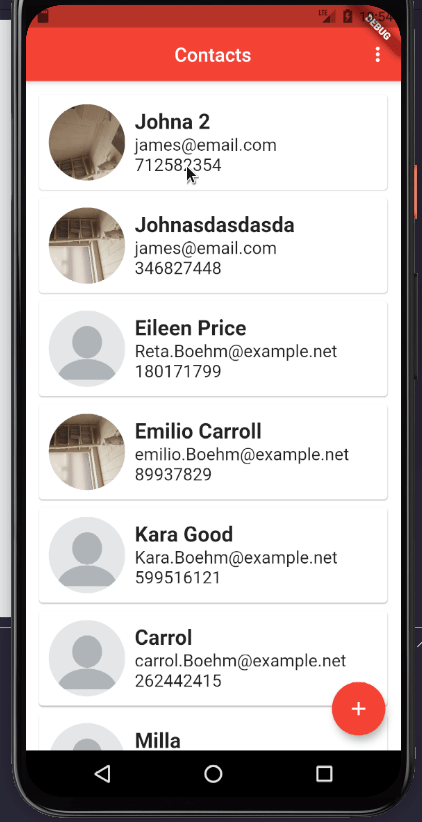
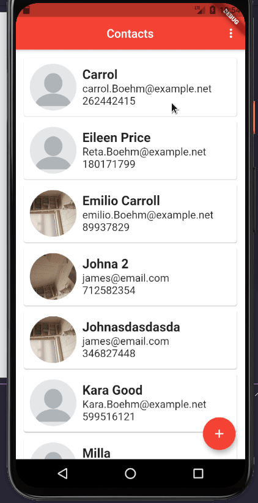
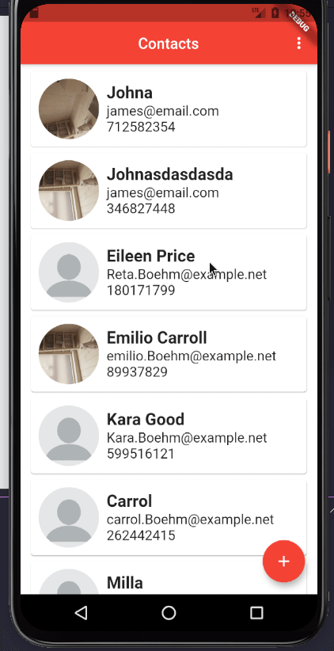

<p align="center">
</img>
</p>
<h3 align="center"> Keep your contacts close
</h3>

<p align="center">
  

  

  <a href="https://github.com/arubesu/contacts_manager/commits/master">
    
  </a>
    

   
</p>


<p align="center">
 <a href="#about">About</a> •
 <a href="#features">Features</a> •
 <a href="#layout">Layout</a> •
 <a href="#how-it-works">How it works</a> •
 <a href="#tech-stack">Tech Stack</a> •
 <a href="#author">Author</a> •
 <a href="#license">License</a>
</p>


## About


📞 save your contacts and keep them close 

---

## Features

- [x] Add new contact
- [x] Edit contact
- [x] Remove contact
- [x] Add contact photo
---

## Layout

<p align="center" style="display: flex; align-items: flex-start; justify-content: center;">

 

  

  

  

</p>


---

## How it works
This application allows you to manage your contacts

### Pre-requisites

Before you begin, you will need to have the following tools installed on your machine:

- [Git](https://git-scm.com)
- [Dart](https://dart.dev/get-dart)
- [Flutter](https://flutter.dev/docs/get-started/install)


In addition, it is good to have an editor to work with the code like [VSCode] (https://code.visualstudio.com/)

Check it out [Flutter -> Set up an editor](https://flutter.dev/docs/get-started/editor?tab=vscode)

#### Running the web application

```bash

# Clone this repository
$ git clone git@github.com:arubesu/contacts_manager.git

# Access the project folder cmd/terminal
$ cd contacts_manager

# install the dependencies
$ flutter packages get

# Run application
$ flutter run

```
---

## Tech Stack

The following tools were used in the construction of the project:

#### [Flutter](https://flutter.dev/) 

-   **[Dart](https://dart.dev/)**
-   **[sqflite](https://pub.dev/packages/sqflite)**
-   **[url_launcher](https://pub.dev/packages/url_launcher)**
-   **[image_picker](https://pub.dev/packages/image_picker)**

> See the file  [pubspec.yaml](https://github.com/arubesu/contacts_manager/blob/master/pubspec.yaml)

---
## How to contribute

1. Fork the project.
2. Create a new branch with your changes: `git checkout -b my-feature`
3. Save your changes and create a commit message telling you what you did: `git commit -m" feature: My new feature "`
4. Submit your changes: `git push origin my-feature`
> If you have any questions check this [guide on how to contribute](https://github.com/firstcontributions/first-contributions)

---

## Author

 
 <br />

 [](https://www.linkedin.com/in/bruno-a-souza/)
---

## License

This project is under the license [MIT](./LICENSE).

Made with ❤️  by Bruno Souza 👋🏽 [Get in Touch!](https://www.linkedin.com/in/bruno-a-souza/)
